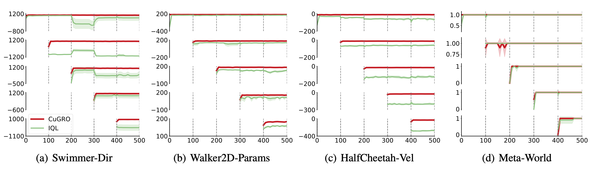

# ICML2024
Performance of CuGRO with generative replay and IQL with exact replay on cumulative tasks during sequential training evaluated on MuJoCo and Meta-World.  The policy is trained with $100$ iterations for each task.

