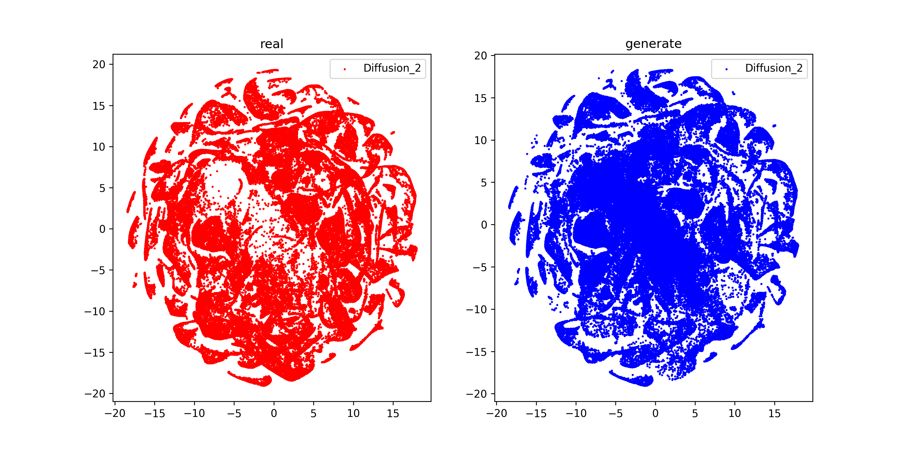
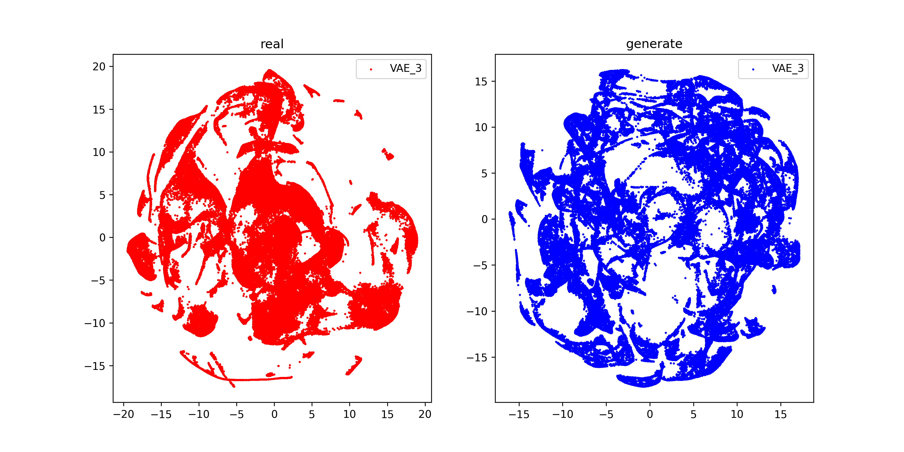

Here we present an example visualization to demonstrate the fidelity of VAE, GAN, and our method when replaying the marginal state distribution on the Swimmer-Dir environment. The size of the dataset for each task in the sequential training process is 100000.

When learning the second task, a visualization comparison of the states generated by CuGRO with different generative models for the first task versus the corresponding real states.

  
  
  

  
  
  

  
  
  

  
  
  

  
  
  

  
  
  

  
  
  

  
  
  

  
  
  

  
  
  

